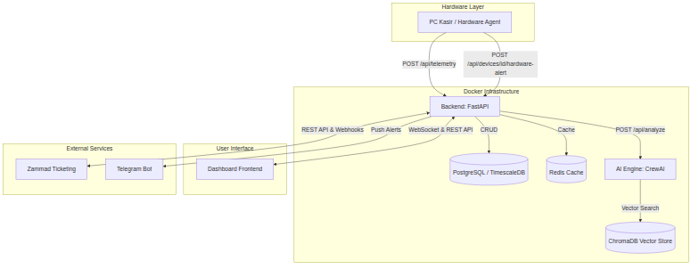

  
  <h1>Helpdesk MKT Agentic AI Automation</h1>
  <h2>Enterprise IT Monitoring & AI-Powered Diagnostik</h2>
  

## 1. Pendahuluan
Sistem **Helpdesk MKT Agentic AI Automation** adalah sebuah ekosistem pemantauan infrastruktur IT terpusat (*Centralized IT Monitoring Ecosystem*) yang didesain secara khusus untuk mengelola 72 perangkat keras (PC Kasir/POS Ticketing & FNB) di 18 lokasi *Site* (Sam's Studio) secara *real-time*.

Dengan mengintegrasikan teknologi pemantauan (*telemetry*), arsitektur layanan mikro (*Microservices*), dan kecerdasan buatan (*Agentic AI*), sistem ini mampu melakukan **diagnostik otomatis, pengumpulan riwayat jaringan, manajemen tiket laporan keluhan secara cerdas, dan merespons kendala IT layaknya asisten virtual**.

---

## 2. Arsitektur Infrastruktur & Docker (Tools Used)

Sistem ini berdiri di atas wadah **Docker Compose** agar mudah dideploy (*Containerized*) dan dipulihkan. Berikut adalah kontainer (*containers*) yang saling terhubung dalam infrastruktur sistem ini:

1. **`mkt_backend` (Backend - Port 8000)**
   - **Teknologi:** Python 3 dengan **FastAPI**.
   - **Fungsi:** Bertindak sebagai jembatan pusat. Menyediakan antarmuka REST API dan WebSocket untuk seluruh sistem. Mengelola lalu lintas data *telemetry* dan menghubungkan *webhook* dari Zammad.
2. **`mkt_crewai` (AI Engine - Port 8002)**
   - **Teknologi:** Python, **CrewAI**, dan integrasi Llama-3.
   - **Fungsi:** Asisten ahli (*Virtual IT Support*). Berfungsi untuk membaca isi tiket, melakukan analisis log, dan merumuskan langkah perbaikan otomatis.
3. **`mkt_postgres` (Database Relasional - Port 5432)**
   - **Teknologi:** **PostgreSQL** dengan ekstensi **TimescaleDB**.
   - **Fungsi:** Menyimpan riwayat *telemetry* detik per detik dengan kompresi tingkat tinggi, serta mengamankan data pengguna (RBAC), perangkat, dan riwayat tiket.
4. **`mkt_redis` (Cache - Port 6379)**
   - **Fungsi:** Mengelola antrean (*queueing*) latar belakang (*background tasks*) dan *cache* sesi *login*.
5. **`mkt_chromadb` (Vector Database - Port 8001)**
   - **Fungsi:** Menyimpan basis pengetahuan (*Knowledge Base*) AI agar AI dapat mengingat solusi dari tiket-tiket sebelumnya (*Retreival-Augmented Generation / RAG*).
6. **MKT Hardware Agent (Client di PC Kasir)**
   - **Teknologi:** **Rust & Tauri** (Aplikasi Native Windows).
   - **Fungsi:** Aplikasi super ringan yang membaca status CPU, Suhu, RAM, aplikasi aktif, dan *plug-and-play* kabel hardware, lalu mengirimkannya setiap 10 detik.
7. **Frontend Web (Dashboard)**
   - **Teknologi:** Vanilla HTML5, CSS3, JS.

---

## 3. Struktur Komunikasi Sistem (Diagram Arsitektur)

  
  
<em>Gambar 1: Blok Arsitektur dan Komunikasi Endpoint Helpdesk MKT</em>

---

## 4. Alur Kerja Nyata per Modul (Workflow & Endpoints)

Sistem memiliki tiga alur kerja otomatisasi (*Workflows*) utama yang dijamin akurat sesuai dengan kode aktual di produksi:

### Workflow 1: Manajemen Insiden Ticketing (Zammad ➔ AI ➔ Dashboard)
Alur ini berjalan ketika ada pegawai cabang yang mengirimkan email keluhan IT atau membuat tiket di Zammad.
1. **Webhook Zammad:** Zammad mengirimkan data tiket baru (*push*) ke Backend melalui `POST /api/zammad/webhook` (atau Backend mengambil paksa jika webhook gagal).
2. **Sinkronisasi Database:** Backend memproses JSON, mendeteksi asal *Site*, dan menyimpannya ke tabel `Ticket` di PostgreSQL.
3. **Penyambutan Otomatis (Greeting):** Backend segera membalas ke Zammad: *"Halo! Laporan Anda sedang dianalisis oleh AI."*
4. **Eksekusi AI (Latar Belakang):** Backend menginstruksikan `mkt_crewai` dengan memanggil `POST /api/tickets/{id}/process`.
5. **Solusi Tersedia:** AI Engine menjawab dengan instruksi spesifik. Solusi diteruskan kembali ke Zammad (agar dibaca pelanggan) dan langsung ter-update di layar Dashboard Admin via WebSocket.

### Workflow 2: Peringatan Darurat Kabel Tercabut (Hardware ➔ AI ➔ Insiden)
Berbeda dengan *telemetry* biasa, ketika sebuah perangkat kasir mengalami kerusakan fisik (contoh: kabel *scanner* atau jaringan tercabut keras), inilah yang terjadi:
1. **Pendeteksian Lokal:** MKT Hardware Agent mendeteksi event *DISCONNECTED* di tingkat Windows (*Device Manager level*).
2. **Pemicu Darurat:** Agent langsung menembak API `POST /api/devices/{device_id}/hardware-alert` ke Backend.
3. **Registrasi Insiden:** Backend menyimpan ini sebagai `IncidentMemory` dengan tingkat keparahan **HIGH**.
4. **Analisis Instan AI:** Alih-alih membuat tiket normal, Backend secara proaktif mengirim payload data tersebut secara langsung ke `http://host.docker.internal:8001/api/analyze` agar AI dapat menilai dampak kerusakan tanpa menunggu manusia.

### Workflow 3: Live Chat Bantuan Kasir (Tier 0 ➔ Escalation)
Sistem dirancang agar Kasir mendapatkan bantuan instan dari AI sebelum mengganggu teknisi IT:
1. **Laporan Awal:** Kasir di *Site* mengetik kendala di kolom chat.
2. **Analisis AI (Tier 0):** *Agent AI* menerima pesan melalui `POST /api/agent_chat/messages/{ticket_id}` dan memberikan rekomendasi perbaikan instan.
3. **Eskalasi ke Manusia:** Jika solusi AI tidak berhasil menyelesaikan masalah, sistem mengizinkan Kasir untuk menekan tombol permintaan bantuan manusia.
4. **Intervensi IT Helpdesk:** Tim IT Helpdesk menerima notifikasi eskalasi, lalu membuka kotak dialog *Live Chat* di Dashboard untuk mengambil alih percakapan secara *real-time* via WebSocket.

### Workflow 4: Sistem Notifikasi Telegram (Alerting)
Sistem Telegram digunakan sebagai peringatan dini (*early warning system*) yang sangat cepat:
1. Ketika *Backend* menerima metrik telemetri yang berbahaya atau status tiket berubah menjadi *Urgent*, *Backend* memanggil modul internal `telegram.py`.
2. Modul ini membungkus pesan menjadi format *Markdown* dan menembak *API Bot Telegram* secara asinkronus (`sendMessage`).
3. Pesan dikirim langsung ke **Grup IT Support**, lengkap dengan detail *Site*, ID Perangkat, dan ringkasan masalah, sehingga tim IT di lapangan bisa merespons bahkan saat tidak membuka Dashboard.

---

## 5. Rincian Lengkap Menu & Fitur Dashboard

Dashboard MKT AI dirancang sebagai *Single Page Application* yang memiliki panel navigasi di sebelah kiri. Berikut adalah rincian lengkap seluruh fungsi di setiap halamannya:

### A. Halaman Dashboard (Pemantauan Utama)
Halaman ini adalah pusat kendali (*Command Center*) IT Helpdesk.
- **Top Metrics (Header):** Menampilkan total Tiket Terbuka, Pelanggaran SLA, Rata-rata Resolusi, dan Perangkat *Online*.
- **Indikator CrewAI:** Indikator *Online/Offline* di pojok kiri bawah yang melakukan *ping* ke port 8002 setiap 15 detik.
- **Kartu Site (Site Cards):** Menampilkan daftar ke-18 lokasi Sam's Studio. Masing-masing kartu menunjukkan progres bar persentase perangkat yang *Online*, beserta jumlah perangkat yang mati. Kartu ini berkedip jika terjadi putus koneksi.
- **Tombol Refresh:** Memuat ulang data metrik tanpa memuat ulang halaman (*AJAX fetch*).

### B. Halaman Tiket (Manajemen Insiden)
Tabel interaktif yang berisi daftar tiket dari seluruh cabang.
- **Tabel Data:** Menampilkan Judul, Site, Status, Waktu berlalu, dan *Confidence Score* (Skor keyakinan AI).
- **Tombol "🤖 AI" (Warna Biru):** Jika diklik, sistem akan memaksa AI Engine untuk menganalisis ulang tiket tersebut (memanggil fungsi `triggerAIForTicket`).
- **Tombol "💬 Chat" (Warna Merah Transparan):** Tombol ini hanya muncul jika kasir meminta eskalasi (*Live Chat Requested*). Menggunakan desain *glassmorphism* merah yang elegan. Jika diklik, akan membuka *modal pop-up* percakapan langsung dengan PC Kasir bersangkutan.

### C. Halaman Sites (Manajemen Lokasi)
Manajemen infrastruktur lokasi cabang. Fitur ini diamankan dengan *Role-Based Access Control (RBAC)*.
- **Informasi Kartu:** Menampilkan nama PIC, Nomor HP, Zona Waktu, dan jumlah perangkat.
- **Tombol "+ Tambah Site" (Tombol Utama):** Untuk meregistrasi cabang baru. Hanya terlihat oleh `SUPER_ADMIN` dan `USER_ADMIN`.
- **Tombol "✏️ Edit" & "🗑️ Hapus":** Digunakan untuk memperbarui data Telegram Group ID atau menghapus cabang. Tombol ini **dihilangkan secara otomatis** jika pengguna login sebagai `OPERATOR` atau `GUEST`.

### D. Halaman Perangkat (Manajemen Hardware)
Tabel inventaris komputer kasir dan status kesehatannya.
- **Indikator Real-Time:** Menampilkan CPU, RAM, Suhu, Aplikasi Aktif, dan URL yang sedang dibuka kasir.
- **Tombol "📡 Ping":** Untuk mengetes latensi koneksi (*ICMP Ping*) ke IP perangkat tersebut langsung dari Dashboard.
- **Tombol "📜 Log":** Menampilkan jendela *modal* riwayat aktivitas (*Telemetry History*) dari perangkat tersebut.
- **Indikator Status Port (🚨 Terputus / ✅ Aman):** Jika diklik, akan membuka jendela *modal* luas (Port Checker) untuk melacak riwayat putus-nyambungnya kabel secara spesifik (*Hardware Alerts*).
- **Tombol "+ Tambah Perangkat", "✏️ Edit", & "🗑️ Hapus":** Fitur pengelolaan inventaris perangkat. Tombol ini juga dilindungi *RBAC* sehingga hanya *Admin* yang bisa memodifikasinya.

### E. Halaman Audit Log
- Menampilkan tabel riwayat siapa melakukan apa. Sangat penting untuk melacak aktivitas user (misalnya: *User A menghapus Perangkat B pada jam X*).

### F. Halaman Manajemen User
Pusat kontrol hak akses tim IT.
- **Tombol "+ Tambah User" & "✏️ Edit":** Menampilkan formulir pembuatan akun.
- **Dropdown Role Akses:** Memiliki 4 pilihan peran: `SUPER_ADMIN`, `USER_ADMIN`, `OPERATOR`, dan `GUEST`. Perubahan peran ini secara langsung menentukan tombol mana saja yang boleh mereka tekan di halaman-halaman sebelumnya.

---

## 6. Arsitektur Tambahan: Zammad & Telegram

Selain sistem inti, kita sangat bergantung pada dua layanan eksternal ini:

### Arsitektur Integrasi Zammad (Ticketing System)
- **Mode Webhook & Polling:** Sistem kita sangat toleran terhadap kegagalan jaringan. Jika fitur Webhook di Zammad gagal mengirim data karena masalah jaringan, *Backend* kita memiliki modul **Active Polling** (di dalam `zammad_webhook.py`) yang berjalan di *background* setiap `N` detik. Sistem ini menembak *REST API* Zammad (`/api/v1/tickets/search`) untuk mencari tiket yang terlewat.
- **Two-Way Sync (Sinkronisasi Dua Arah):** Tidak hanya mengambil tiket, *Backend* kita juga memiliki akses tulis (`PUT`/`POST`) ke Zammad. Ketika AI telah selesai melakukan analisis, solusinya akan didorong kembali (*pushed back*) ke Zammad sebagai *Public Article* sehingga pelanggan yang membuka Zammad pun dapat membaca solusi AI tersebut.

### Arsitektur Integrasi Telegram
- **Sistem Peringatan Tanpa Henti (Stateless Alerting):** Berbeda dengan sistem tiket yang menunggu dibaca, modul Telegram berfungsi sebagai alat "interupsi". Modul ini merangkai format teks pesan (dengan *bold*, *italic*, dan emoji) dan menggunakan API standar `https://api.telegram.org/bot<TOKEN>/sendMessage`.
- **Pemisahan Notifikasi (Targeting):** *Backend* dirancang untuk mampu mengirimkan notifikasi ke **Chat ID** yang berbeda-beda. Misalnya, masalah di *Site* Bali akan dikirim ke Grup Telegram lokal Bali, sementara *Hardware Failure* kritis akan langsung ditembakkan ke Grup Telegram IT Pusat. Hal ini meminimalisir kebisingan notifikasi (*alert fatigue*).

---

  <strong>"Menyatukan Potensi Perangkat Keras, Kecerdasan Buatan, dan Sistem Tiketing Laporan Terpadu dalam Wadah Berperforma Tinggi"</strong> 
  - PT Megakreasi Tech (MKT)

